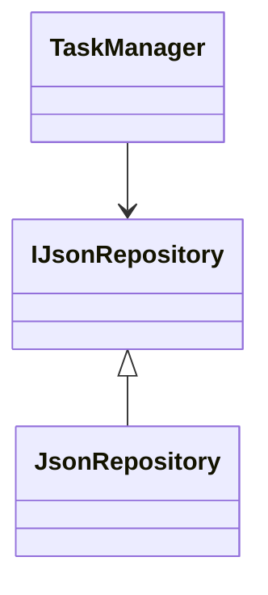

# To-Do Konsolenanwendung (C#)

## Projektbeschreibung

Dieses Projekt ist eine Konsolenanwendung zur Verwaltung von Aufgaben.  
Die Anwendung wurde im Rahmen der Ausbildung zum Fachinformatiker für Anwendungsentwicklung erstellt.

## Features

- Aufgaben erstellen
- Aufgaben anzeigen
- Aufgaben als erledigt markieren
- Aufgaben löschen
- Persistente Speicherung (JSON)
- Multi-Notebook-System (mehrere Aufgabenlisten)

## Architektur

Die Anwendung basiert auf einer Schichtenarchitektur:

- Program → Benutzeroberfläche
- TaskManager → Geschäftslogik
- IJsonRepository → Abstraktion
- JsonRepository → Persistenz

## Technologien

- C#
- .NET
- System.Text.Json
- JSON

## Architekturdiagramm

