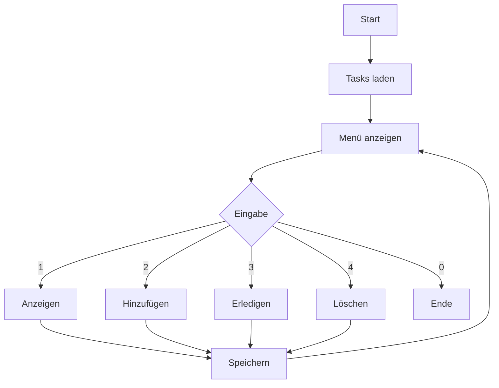
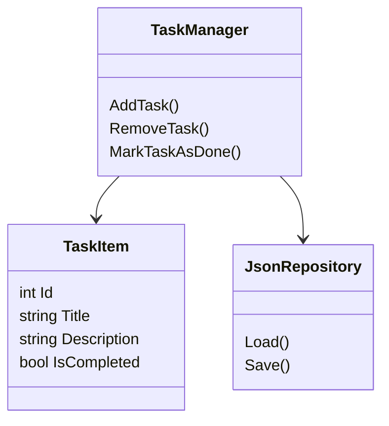

# Projektdokumentation – Entwicklung einer To-Do Konsolenanwendung (C#)

## 1. Einleitung und Zielsetzung

Im Rahmen der Ausbildung zum Fachinformatiker für Anwendungsentwicklung wurde eine Konsolenanwendung zur Verwaltung von Aufgaben entwickelt.

Ein besonderes Ziel des Projekts war es, das **Repository-Design-Pattern** in einer einfachen Form umzusetzen.

Die Anwendung bietet folgende Funktionen:

- Erstellen von Aufgaben
- Anzeigen der Aufgaben
- Markieren von Aufgaben als erledigt
- Löschen von Aufgaben
- Persistente Speicherung

Zusätzlich wurde das System später um ein **Multi-Notebook-System** erweitert.

---

## 2. Analyse der Anforderungen

### Funktionale Anforderungen
- Aufgaben erstellen
- Aufgaben anzeigen
- Aufgaben als erledigt markieren
- Aufgaben löschen
- Persistente Speicherung

### Nicht-funktionale Anforderungen
- Einfache Bedienung
- Verständliche Struktur
- Wartbarkeit
- Erweiterbarkeit

---

## 3. Programmablaufplan

Zur Visualisierung des Programmablaufs wurde ein Programmablaufplan erstellt.



---

## 4. Entwurf

### Architektur
- Program (UI)
- TaskManager (Logik)
- JsonRepository (Persistenz)
- TaskItem (Datenmodell)



---

## 5. Implementierung UI

Die Benutzeroberfläche wurde als Konsolenmenü umgesetzt. Die Entwicklung erfolgte iterativ, sodass erste Teile der Geschäftslogik direkt integriert wurden und getestet werden konnten.

```csharp
case "1": ShowTasks(manager);

case "2": AddTask(manager);
```

---

## 6. Persistenz

Zur Speicherung wurde System.Text.Json verwendet. JSON wurde gewählt da es ein leichtgewichtiges und gut lesbares Format ist und keine zusätzliche Infrastruktur benötigt.

Quellen:
- https://code-maze.com/introduction-system-text-json-examples/
- https://www.youtube.com/watch?v=w6M-Bj-tfv4

### 6.1 Serialisierung

```csharp
JsonSerializer.Serialize(tasks);
JsonSerializer.Deserialize<List<TaskItem>>(json);
```

### 6.2 ToString Problem

Standardmäßig wird nur der Klassenname ausgegeben. Dies liegt daran, dass die Standard-Implementierung von `ToString()` nur den Klassennamen zurückgibt.

Um eine sinnvolle Ausgabe zu ermöglichen, wurde die Methode überschrieben:

```csharp
public override string ToString()
```

Dadurch konnte die Ausgabe direkt über `Console.WriteLine(task)` erfolgen.

---

## 7. Geschäftslogik

Die Geschäftslogik wurde im `TaskManager` zentral umgesetzt.
Dabei wurden alle Operationen zur Datenverwaltung (CRUD) implementiert und gebündelt.

Der TaskManager bildet die zentrale Komponente der Anwendung und stellt sicher, dass alle Änderungen an den Aufgaben konsistent verarbeitet und anschließend persistent gespeichert werden.  
Durch diese Kapselung bleibt die Benutzeroberfläche unabhängig von der eigentlichen Logik.

Vervollständigen der CRUD-Funktionalität.

- Create: `AddTask()`
- Read: `GetAllTasks()`
- Update: `MarkTaskAsDone()`
- Delete: `RemoveTask()`

```csharp
_tasks.RemoveAt(i);
task.IsCompleted = true;
```

---

## 8. Erweiterung: Multi-Notebook-System

### Ziel
Mehrere unabhängige Aufgabenlisten verwalten. 

Die Erweiterung wurde eingeführt, um die Anwendung funktional zu verbessern und eine realistischere Nutzung zu ermöglichen. 

Anstatt alle Aufgaben in einer einzigen Liste zu speichern, kann der Benutzer mehrere getrennte Notizbücher verwenden.

Dadurch wird die Anwendung übersichtlicher und besser skalierbar, da Aufgaben logisch nach Kontext oder Zweck getrennt werden können.


Das System war ursprünglich nicht Bestandteil der funktionalen Anforderungen, da der Fokus zuerst auf der Umsetzung der Grundfunktionalität lag.

Die Erweiterung wurde im weiteren Projektverlauf ergänzt, nachdem die Kernfunktionen vollständig implementiert und getestet waren. Das entspricht einem iterativen Entwicklungsansatz, bei dem die Anwendung schrittweise erweitert wird.

### Repository Pattern

https://www.youtube.com/watch?v=8fFBWmbUaIg

Einführung eines Interfaces:

```csharp
interface IJsonRepository
```

### Anpassung
- JsonRepository implementiert Interface
- TaskManager nutzt Interface
- NotebookManager verwaltet Notebooks

---

## 9. Erweiterung (Detail)

### 9.1 Konzept

Jedes Notebook = eigene Datei (notebook_(name).json)

### 9.2 Grundprinzip der Notebooks

Jedes Notebook wird durch eine eigen JSON-Datei repräsentiert. Die Aufgaben werden ausschließlich in "seinem" Notebook gespeichert und geladen.

Dass das Notebook eindeutig indentifiziert werden kann wurde eine Namenskonvention eingeführt.

`notebook_(name).json`

Beispiele:
- notebook_tasks.json
- notebook_arbeit.json

Damit ist sichergestellt, dass nur relevante Dateien verarbeitet werden und verhindert dass Konflikte mit anderen JSON-Dateien entstehen.

### 9.3 Implementierung der Notebookverwaltung

Zur Verwaltung wurde eine Klasse `NotebookManager` eingeführt.

Folgendes sind die Aufgaben:
- Auflisten vorhandener Notebooks
- Erstellen neuer Notebooks
- Laden vorhandener Notebooks

Die Klasse greift direkt auf das Dateisystem zu und erkennt vorhandene Notebooks anhand der Namenskonvention.

### 9.4 Trennung von Create() und Load()

Zentral für die Funktionsweise war eine klare Trennung zwischen:

- **CreateNotebook()** --> erstellt neue Datei
- **LoadNotebook()** --> lädt eine bestehende Datei

Vor der Einführung der Trennung wurde für beide Fälle dieselbe Methode verwendet. Dadurch wurden bestehende Dateien überschrieben.

```csharp
if (!File.Exists(filePath))
{
    File.WriteAllText(filePath, "[]");
}
```

Es wird nur eine Datei erzeugt wenn sie noch nicht existiert.

### 9.5 Integration in den Programmablauf

Beim Start wird der Benutzer dazu aufgefordert ein Notebook auszuwählen oder ein neues zu erstellen.

- Anzeige Notebooks
- Auswahl per index
- Erstellung über Eingabe eines Namens

Das ausgewählte Notebook bestimmt die Datenquelle und wird an den TaskManager übergeben.

### 9.6 Anpassung des Repository Patterns

Ursprünglich war die Persistenz direkt an die Klasse `JasonRepository` gebunden. Im Rahmen der Erweiterung wurde das Repository Pattern vollständig umgesetzt:

```csharp
public interface IJsonRepository
{
    List<TaskItem> Load();
    void Save(List<TaskItem> tasks);
}
```
Der `TaskManager` verwendet jetzt ausschließlich das Interface.

### 9.7 Probleme bei der Umsetzung

**Problem 1: Falsche Dateien wurden erkannt**

Zu Beginn wurden alle JSON-Dateien im Verzeichnis geladen. Dadurch wurden auch Systemdateien wie:
- .deps.json
- .runtimeconfig.json
als Notebooks erkannt.

**Lösung:** Einführung der Namenskonvention

---

**Problem 2: Dateien wurden überschrieben**

Beim Öffnen eines bestehenden Notebooks wurden Inhalte gelöscht.

**Urache:** Keine Trennung zwischen Erstellen und Laden eines Notebooks

**Lösung:** Einführung separater Methoden für Create und Load sowie einer Prüfung ob die Datei bereits existiert.

---

**Problem 3: Unsaubere Anzeige der Notebooknamen auf der Konsole**

Die Notebooknamen wurden zunächst inklusive Präfix dargestellt:
`notebook_tasks`

**Lösung:** Entfernung des Präfixes in der Anzeige
```csharp
Path.GetFileNameWithoutExtension(file).Replace("notebook_", "")
```

---

## 10. Fazit

Das Projekt zeigt eine saubere Architektur sowie die Umsetzung des Repository Patterns inkl. Erweiterung. Die finale Architektur entspricht vollständig dem Repository Pattern, da die Geschäftslogik ausschließlich über ein Interface mit der Datenhaltung kommuniziert.

---

## 11. Ausblick

- Datenbankanbindung
- GUI
- Multi-User
