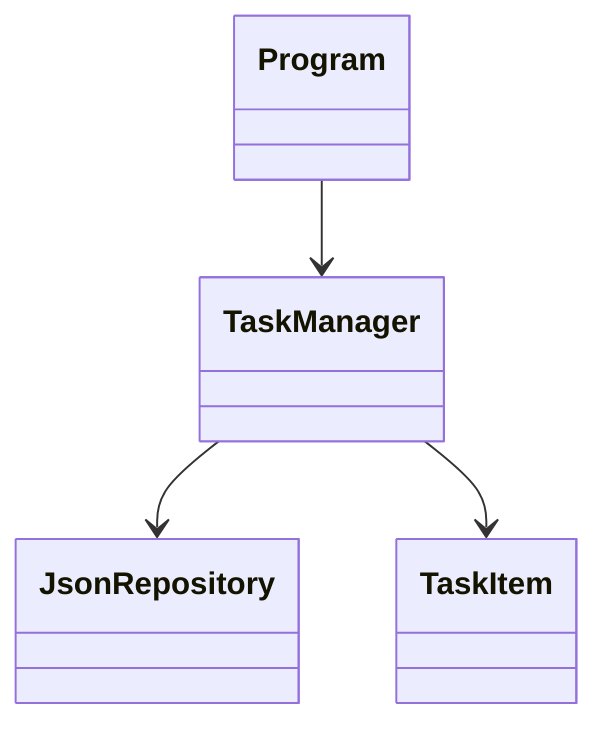

# Projekttitel
To-Do Konsolenanwendung

Fachinformatiker Anwendungsentwicklung

---

# Agenda

- Projektüberblick
- Live-Demo
- Besonderer technischer Aspekt
- Fazit

---

# Projektziel

- Verwaltung von Aufgaben
- Speicherung über JSON
- einfache Konsolenbedienung
- Erweiterbar aufgebaut

---

# Funktionen

- Aufgaben hinzufügen
- Aufgaben anzeigen
- Aufgaben erledigen
- Aufgaben löschen

---

# Architektur (Basis)



---

# Live Demo

---

# Technischer Aspekt

Ich gehe nun auf einen besonderen technischen Aspekt ein:

👉 Nutzung des Repository Design Patterns

---

# Problemstellung

- TaskManager greift direkt auf JSON zu
- starke Kopplung
- schwer erweiterbar

---

# Ziel

- Trennung von Logik und Datenzugriff
- bessere Wartbarkeit
- Erweiterbarkeit

---

# Repository Pattern

Grundidee:

TaskManager → Repository → Daten

---

# Struktur nach Umsetzung

```text
TaskManager → IJsonRepository → JsonRepository
```

---

# Interface

```csharp
public interface IJsonRepository
{
    List<TaskItem> Load();
    void Save(List<TaskItem> tasks);
}
```

---

# TaskManager

```csharp
public TaskManager(IJsonRepository repository)
```

- kennt keine konkrete Implementierung

---

# Vorteile

- lose Kopplung
- austauschbare Datenquelle
- bessere Erweiterbarkeit

---

# Beispiel Erweiterung

- mehrere JSON Dateien
- Datenbank

---

# Multi-Notebook Bezug

- jede Datei eigenes Repository
- Geschäftslogik bleibt erhalten

---

# Fazit

- Anwendung erfolgreich umgesetzt
- Architektur erweitert
- Design Pattern korrekt angewendet

---

# Ausblick

- Datenbank
- GUI
- Multi-User
