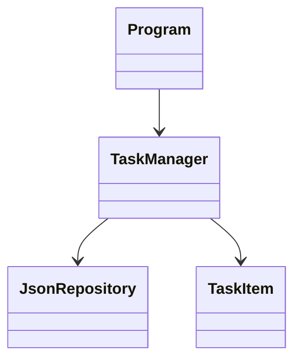

# To-Do Konsolenanwendung (C#)
## Präsentation (Obsidian Slides)

---

# Projekttitel
To-Do Konsolenanwendung

Fachinformatiker Anwendungsentwicklung

---

# Agenda

- Projektüberblick
- Live-Demo
- Besonderer technischer Aspekt
- Fazit

---

# Projektziel

- Verwaltung von Aufgaben
- Speicherung über JSON
- einfache Konsolenbedienung
- Erweiterbar aufgebaut

---

# Funktionen

- Aufgaben hinzufügen
- Aufgaben anzeigen
- Aufgaben erledigen
- Aufgaben löschen

---

# Architektur (Basis)



---

# Live Demo

## Ablauf

- Programm starten
- Notebook auswählen
- Menü anzeigen

---

# Live Demo – Funktionen

- Aufgabe hinzufügen
- Aufgaben anzeigen
- Aufgabe erledigen
- Aufgabe löschen

---

# Übergang

Ich gehe nun auf einen besonderen technischen Aspekt ein:

👉 Repository Design Pattern

---

# Problemstellung

- TaskManager greift direkt auf JSON zu
- starke Kopplung
- schwer erweiterbar

---

# Ziel

- Trennung von Logik und Datenzugriff
- bessere Wartbarkeit
- Erweiterbarkeit

---

# Repository Pattern

Grundidee:

TaskManager → Repository → Daten

---

# Struktur nach Umsetzung

```text
TaskManager → ITaskRepository → JsonTaskRepository
```

---

# Interface

```csharp
public interface ITaskRepository
{
    List<TaskItem> Load();
    void Save(List<TaskItem> tasks);
}
```

---

# TaskManager

```csharp
public TaskManager(ITaskRepository repository)
```

- kennt keine konkrete Implementierung

---

# Vorteile

- lose Kopplung
- austauschbare Datenquelle
- bessere Erweiterbarkeit

---

# Beispiel Erweiterung

- mehrere JSON Dateien
- mehrere Notebooks

---

# Multi-Notebook Bezug

- jede Datei eigenes Repository
- gleiche Logik bleibt erhalten

---

# Fazit

- Anwendung erfolgreich umgesetzt
- Architektur erweitert
- Design Pattern korrekt angewendet

---

# Ausblick

- Datenbank
- GUI
- Multi-User
